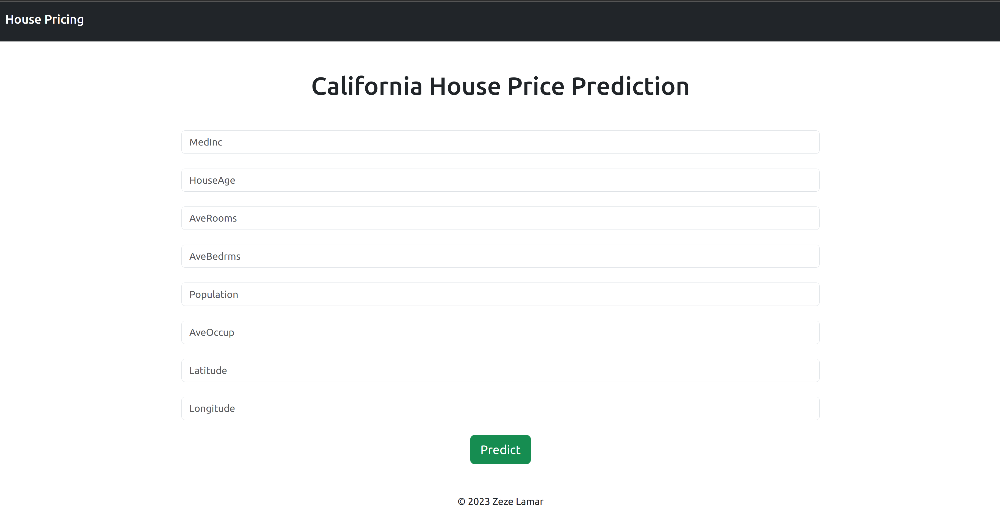

# California House Pricing Prediction with Linear Regression

### Software and Tools Requirementz

1. [Github Account](https://github.com/)
2. [Heraku Account](https://www.heroku.com/)
3. [VS Code IDE](https://code.visualstudio.com/)
4. [Git ClI](https://git-scm.com/book/en/v2/Getting-Started-The-Command-Line)
 
Create a new environment

```
conda create -p venv python==3.7 -y 
```

## Demo
